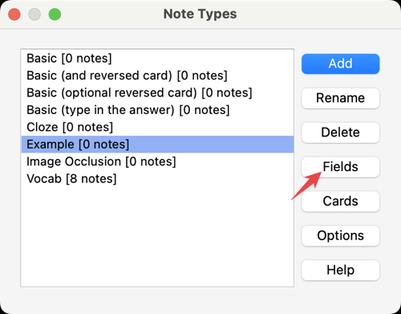

# Vocab Builder

Vocab Builder is a tool for assisting in learning English. Specifically, it accepts sentences and automatically translates them into Chinese. Additionally, phonetic symbols of the words in a sentence can be inserted if there is any uncertainty regarding the words.

After collecting the sentences, the data can be exported as a TXT file and imported into Anki for memorization. To do this, head to the `/setting` page of the app, and click the Export button.

But before importing, a few steps have to be taken to prepare Anki for accepting the vocab data.

## Anki preparation

1. create a new Anki note type; check [here](https://docs.ankiweb.net/editing.html#:~:text=To%20create%20a%20new%20type%20of%20note%2C%20choose%20Tools%20%E2%86%92%20Manage%20Note%20Types%20from%20the%20main%20Anki%20window.%20Then%20click%20%22Add%22%20to%20add%20a%20new%20type%20of%20note.%20You%20will%20now%20see%20another%20screen%20that%20gives%20you%20a%20choice%20of%20note%20types%20to%20base%20the%20new%20type%20on.) for the steps, It's good enough to choose the `Add: Basic` option in the Add Note Type dialog. Then give it a name you find appropriate.
   

2. Select the newly created Note Type, hit the `fields` button on the right-hand side of the Note Types dialog to open the `Fields for [note type name]` dialog window. Then click the `Add` button to add a new field and name the new field as `Note` (recommended). Click Save.
   

## Importing

During importing, make sure you choose the aforementioned Note Type as the specified one in the Import Options section of the Import File dialog, then things should click automatically.

